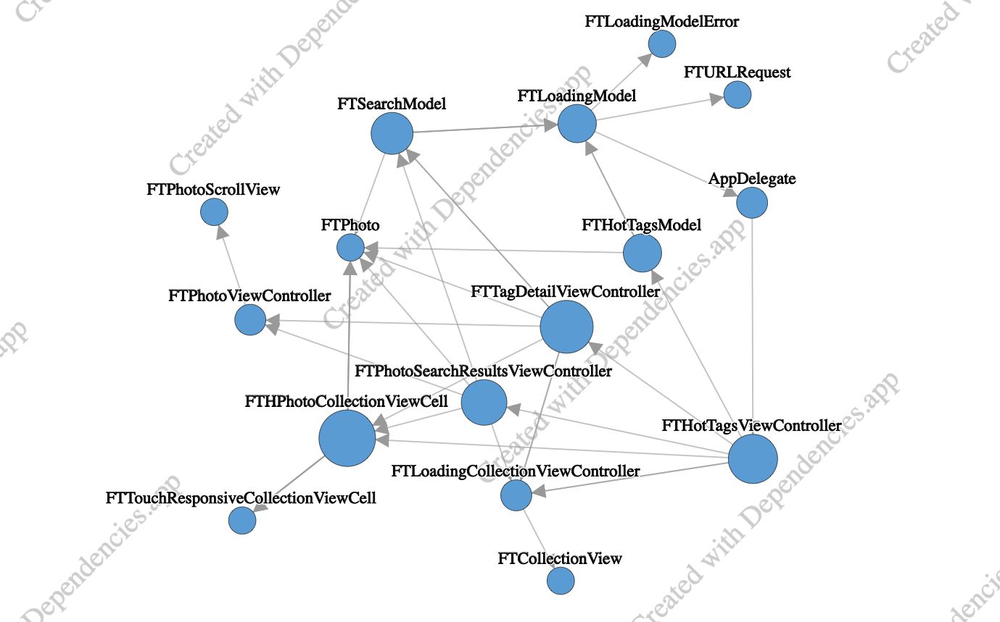

# About

This is a simple app designed as a test task for Digital Design company. It is fully written in Objective-C without storyboards and brand new Apple scenes. It depends on only one dependency - [SDWebImage](https://github.com/SDWebImage/SDWebImage) - just for images caching and preventing spam on Flickr servers.

